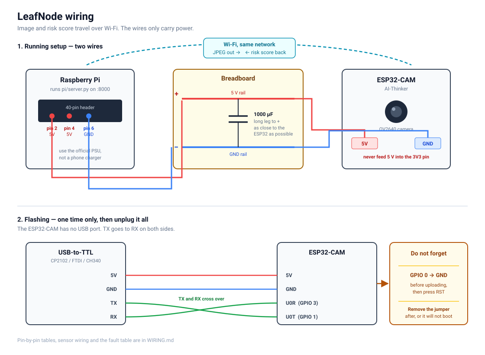

# Wiring



Two boards, one breadboard. The ESP32-CAM is the eye, the Raspberry Pi is the
brain. They talk over Wi-Fi, not over wires, so the breadboard only carries
power, the flashing header, and any sensors you add.

---

## 1. What you need

| Part | Why |
|---|---|
| AI-Thinker ESP32-CAM | camera node |
| USB-to-TTL adapter (CP2102 / FTDI / CH340) | the ESP32-CAM has **no USB port**, you cannot flash it without one |
| Raspberry Pi (yours, 8 GB) + its official PSU | runs the model |
| Breadboard + jumper wires | power rail and the flashing header |
| 1000 µF electrolytic capacitor, 6.3 V or higher | stops the brownout resets, see section 6 |
| Optional: DHT22, capacitive soil probe, ADS1115 | sensor context for the score |

---

## 2. Power, the part people get wrong

**Feed the ESP32-CAM 5 V, not 3.3 V.**

The board has its own regulator. Its `5V` pin expects 5 V and the onboard
regulator makes the 3.3 V the chip needs. If you feed 5 V into the `3V3` pin
you will destroy it, and if you feed 3.3 V into the `5V` pin it will brown out
the moment the Wi-Fi radio transmits.

From the Pi's 40-pin header:

| Pi pin | Goes to | Note |
|---|---|---|
| Pin 2 or 4 (5 V) | breadboard **+ rail** | |
| Pin 6 (GND) | breadboard **− rail** | |

Then from the rails:

| Breadboard | ESP32-CAM pin |
|---|---|
| + rail (5 V) | `5V` |
| − rail (GND) | `GND` |

Put the **1000 µF capacitor across the + and − rails**, as close to the
ESP32-CAM as you can get it. Long leg to +, short leg to −. Getting this
backwards makes it vent, so check twice.

The ESP32-CAM idles near 80 mA and spikes past 250 mA when the camera and the
radio fire together. That spike is what the capacitor covers.

> If the node keeps rebooting, stop trying to fix it in software and give it
> its own 5 V supply instead of the Pi header. That solves it nine times out of ten.

---

## 3. Flashing, first time only

The ESP32-CAM cannot flash itself. Wire the USB-TTL adapter like this, and
note that **TX goes to RX** on both sides:

| USB-TTL adapter | ESP32-CAM |
|---|---|
| GND | GND |
| 5V | 5V |
| TX | `U0R` (GPIO 3) |
| RX | `U0T` (GPIO 1) |

Then the one step everybody forgets:

**Jumper `GPIO 0` to `GND`.** That is what puts the chip in bootloader mode.

Sequence:

1. `GPIO 0` → `GND`
2. Plug the USB-TTL adapter into your computer
3. Press the `RST` button on the back of the ESP32-CAM
4. Upload from the Arduino IDE
5. **Remove the `GPIO 0` jumper**
6. Press `RST` again

If you skip step 5 the board just sits in the bootloader and nothing happens.

Set the adapter's voltage jumper to **3.3 V for the data lines** if it has one.
The ESP32 is a 3.3 V part; many adapters run happily anyway, but 3.3 V is the
correct answer.

Arduino IDE settings:

- Board: **AI Thinker ESP32-CAM**
- Partition Scheme: **Huge APP (3MB No OTA/1MB SPIFFS)**
- Upload speed: 115200 if 921600 fails

Libraries to install: **ArduinoJson** (by Benoit Blanchon). Add **DHT sensor
library** and **Adafruit ADS1X15** only if you enable those sensors.

### 3b. No USB-TTL adapter? Flash through the Pi

The Pi's header has a 3.3 V serial port, which is exactly what the ESP32
wants, so the Pi can do the adapter's job. Two wires on top of the power
wiring you already have:

| Pi pin | ESP32-CAM |
|---|---|
| Pin 8 (GPIO 14, TX) | `U0R` |
| Pin 10 (GPIO 15, RX) | `U0T` |

GND is already shared through the breadboard rail. Then:

1. On the Pi, once: `bash ~/leafnode/pi/flash_esp32.sh setup`, then `sudo reboot`
2. Build the firmware on the laptop (Arduino IDE: **Sketch > Export Compiled
   Binary**) and copy `leafnode.ino.merged.bin` to the Pi
3. Jumper `GPIO 0` to `GND`, press `RST`
4. `bash ~/leafnode/pi/flash_esp32.sh flash leafnode.ino.merged.bin`
5. Remove the jumper, press `RST`
6. `bash ~/leafnode/pi/flash_esp32.sh monitor 40` shows the boot log

Leave the two serial wires in afterwards. The node's log then arrives on the
Pi, which beats carrying a laptop into the greenhouse.

An ESP32-CAM-MB (the little micro-USB base board many kits ship with) also
works: seat the ESP32-CAM on it, plug it into the laptop, hold `IO0`, tap
`RST`, and upload straight from the Arduino IDE.

---

## 4. After flashing, the running setup

Pull the USB-TTL adapter out entirely. The node now needs exactly two wires:

```
Pi 5V  (pin 2) ───────── + rail ───────── ESP32-CAM 5V
Pi GND (pin 6) ───────── − rail ───────── ESP32-CAM GND
                            │
                         1000 µF
```

That is the whole connection. Image and risk score both travel over Wi-Fi.

Keep the USB-TTL adapter on `U0R`/`U0T` while you are debugging, so you can
watch the serial log at 115200 baud. It tells you the IP, the frame size, the
upload time and the risk score it got back.

---

## 5. Optional sensors

Read this before you pick pins, because the ESP32-CAM has a trap in it.

**Almost every free pin is ADC2, and ADC2 does not work while Wi-Fi is on.**
`analogRead()` on GPIO 2, 4, 12, 13, 14 or 15 returns garbage the moment the
radio is up. This is a silicon limitation, not a bug you can code around.

So: **anything analogue goes through an I2C ADC**, not through a GPIO.

| Pin | Use | Notes |
|---|---|---|
| GPIO 13 | DHT22 data | digital, so ADC2 does not matter |
| GPIO 14 | I2C `SDA` | to ADS1115 |
| GPIO 15 | I2C `SCL` | to ADS1115 |
| GPIO 2 | spare | also SD data, free if you do not use the card slot |
| GPIO 12 | **avoid** | boot strapping pin, a pull-up here bricks the boot |
| GPIO 0 | **never** | camera clock and the bootloader strap |
| GPIO 16 | **never** | PSRAM chip select on this board |
| GPIO 4 | onboard flash LED | blindingly bright, `USE_FLASH_LED` in config.h |
| GPIO 33 | onboard red LED | active LOW, used for status blinks |

### DHT22

| DHT22 | Goes to |
|---|---|
| VCC | 3.3 V rail |
| DATA | GPIO 13 |
| GND | − rail |

Add a **10 kΩ resistor between DATA and VCC**. Without that pull-up the reads
fail intermittently, which is maddening to debug.

### Capacitive soil probe via ADS1115

| ADS1115 | Goes to |
|---|---|
| VDD | 3.3 V rail |
| GND | − rail |
| SCL | GPIO 15 |
| SDA | GPIO 14 |
| ADDR | GND (sets address `0x48`) |
| A0 | soil probe signal (AOUT) |

Soil probe VCC to 3.3 V, GND to − rail.

Use a **capacitive** probe, not the cheap two-prong resistive one. The
resistive kind corrodes away within weeks in wet soil.

Then set `ENABLE_DHT` and/or `ENABLE_ADS1115` to `1` in `firmware/leafnode/config.h`.

### Calibrating the soil probe

The defaults in `config.h` are guesses. Do this once:

1. Set `ENABLE_ADS1115 1`, flash, open the serial monitor
2. Hold the probe in **dry air**, note `soil_raw` → that is `SOIL_RAW_DRY`
3. Stand it in **a glass of water** up to the line marked on the probe, note
   `soil_raw` → that is `SOIL_RAW_WET`
4. Put both numbers in `config.h` and reflash

---

## 6. When it misbehaves

| What you see | What it is |
|---|---|
| `Brownout detector was triggered`, endless reboots | power. Add the capacitor, or give it its own 5 V supply. Do not disable the brownout detector, it is telling you the truth. |
| `Camera probe failed 0x105` | ribbon cable not seated. Flip the black latch up, push the ribbon fully in, press the latch down. |
| Upload never starts, `Failed to connect` | `GPIO 0` is not grounded, or you did not press `RST` after grounding it |
| Flashes fine, then nothing on serial | you left the `GPIO 0` jumper in. Remove it and press `RST`. |
| First photo is green or white | normal, the sensor is still setting exposure. The firmware already throws three frames away before keeping one. |
| Node connects but the Pi never answers | the Pi is not listening on all interfaces. Start uvicorn with `--host 0.0.0.0`, not the default. |
| `[http] server said 401` | `NODE_KEY` in `secrets.h` does not match `LEAFNODE_NODE_KEY` in the Pi's `.env`. |
| `[http] server said 503: LEAFNODE_NODE_KEY is not set` | run `setup.sh` on the Pi, it generates the key. |
| `[wifi] connecting.....` then `timed out` | the ESP32 only sees **2.4 GHz** Wi-Fi. A 5 GHz-only network, or a dual-band one with a single name that steers it to 5 GHz, will never connect. |
| `secrets.h: No such file` when compiling | copy `secrets.example.h` to `secrets.h` in the same folder. |
| `no PSRAM found` in the log | bad board or bad solder on the PSRAM chip. Frame size drops and large captures will fail. |

---

## 7. Sanity check before you trust it

```bash
curl http://<pi-ip>:8000/health
```

If that answers from your laptop, the ESP32 will reach it too. If it only
answers on the Pi itself, fix `--host 0.0.0.0` first.
